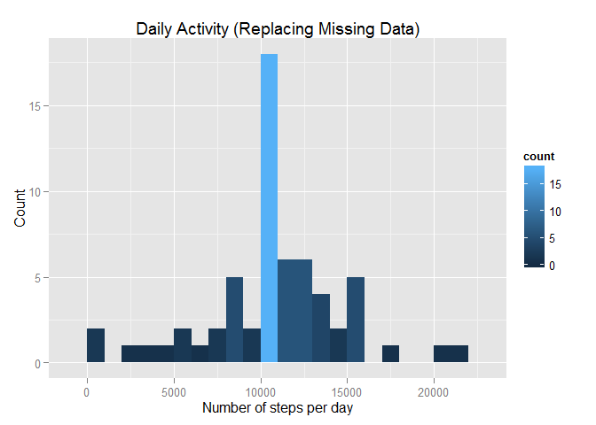
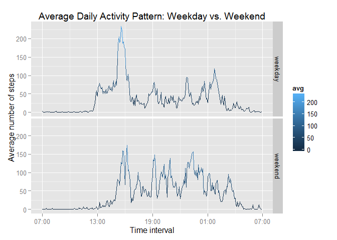

# Reproducible Research: Peer Assessment 1


## Loading and preprocessing the data

1. Apply packages

Package *dplyr* is used for data processing, and package *ggplot2* is used for ploting.


```r
library(dplyr)
library(ggplot2)
```

2. Load the data

```r
unzip("activity.zip")
activity <- read.csv("activity.csv")
```

## What is mean total number of steps taken per day?

1. Processing the data

Here a new data.frame is made with two columns: one for date and one for the sum of steps of that day.


```r
daily.steps <- activity %>% group_by(date) %>% 
    summarize(sum = sum(steps, na.rm = TRUE))
head(daily.steps)
```

```
## Source: local data frame [6 x 2]
## 
##         date   sum
## 1 2012-10-01     0
## 2 2012-10-02   126
## 3 2012-10-03 11352
## 4 2012-10-04 12116
## 5 2012-10-05 13294
## 6 2012-10-06 15420
```

2. Plot the histogram

```r
h <- ggplot(daily.steps, aes(x = sum))
h + geom_histogram(binwidth = 1000, aes(fill = ..count..)) +
    labs(list(title = "Daily Activity", 
              x = "Number of steps per day", y = "Count"))
```

 

3. Calculate the mean and median of steps taken per day

```r
mean(daily.steps$sum)
```

```
## [1] 9354.23
```

```r
median(daily.steps$sum)
```

```
## [1] 10395
```

## What is the average daily activity pattern?

1. Data processing

The first line of the code makes a new data.frame containing the average number of steps of each 5-minute interval. The second line converts the class of time interval from character to time ("POSIXlt" "POSIXt"), which lets the time axis of the following plot more straightforward.


```r
avg.activity <- activity %>% group_by(interval) %>% 
    summarize(avg = mean(steps, na.rm = TRUE))
avg.activity$time <- strptime(sprintf("%04d", avg.activity$interval), 
                          format="%H%M")
str(avg.activity)
```

```
## Classes 'tbl_df', 'tbl' and 'data.frame':	288 obs. of  3 variables:
##  $ interval: int  0 5 10 15 20 25 30 35 40 45 ...
##  $ avg     : num  1.717 0.3396 0.1321 0.1509 0.0755 ...
##  $ time    : POSIXlt, format: "2015-07-17 00:00:00" "2015-07-17 00:05:00" ...
##  - attr(*, "drop")= logi TRUE
```

2. Make a time series plot

```r
library(scales) # for using scale_x_datetime
t <- ggplot(avg.activity, aes(x = time, y = avg))
t + geom_line(aes(colour = avg)) + 
    scale_x_datetime(labels = date_format("%H:%M")) +
    labs(list(title = "Average Daily Activity Pattern", 
              x = "Time interval", 
              y = "Average number of steps"))
```

 

3. Find the interval with the maximum value

```r
avg.activity$interval[which.max(avg.activity$avg)]
```

```
## [1] 835
```

## Imputing missing values

1. Calculate the total number of missing values in the dataset

```r
sum(is.na(activity$steps))
```

```
## [1] 2304
```

2. Filling in all of the missing values

Here the strategy is to fill all of the missing values in the dataset by the mean for that 5-minute interval. It first add a new column containing the average value of that interval ("avg"), and then replace the steps value by it if the value of steps is NA.


```r
new.activity <- activity %>% group_by(interval) %>% 
    mutate(avg = mean(steps, na.rm = TRUE)) 
new.activity$steps[!complete.cases(new.activity)] <-
    new.activity$avg[!complete.cases(new.activity)]
head(new.activity)
```

```
## Source: local data frame [6 x 4]
## Groups: interval
## 
##       steps       date interval       avg
## 1 1.7169811 2012-10-01        0 1.7169811
## 2 0.3396226 2012-10-01        5 0.3396226
## 3 0.1320755 2012-10-01       10 0.1320755
## 4 0.1509434 2012-10-01       15 0.1509434
## 5 0.0754717 2012-10-01       20 0.0754717
## 6 2.0943396 2012-10-01       25 2.0943396
```

3. Make a histogram of the total number of steps taken each day

```r
new.daily.steps <- new.activity %>% group_by(date) %>% 
    summarize(sum = sum(steps, na.rm = TRUE))

h <- ggplot(new.daily.steps, aes(x = sum))
h + geom_histogram(binwidth = 1000, aes(fill = ..count..)) +
    labs(list(title = "Daily Activity (Replacing Missing Data)", 
              x = "Number of steps per day", y = "Count"))
```

 

4. Calculate the mean and median total number of steps taken per day

```r
mean(new.daily.steps$sum)
```

```
## [1] 10766.19
```

```r
median(new.daily.steps$sum)
```

```
## [1] 10766.19
```

## Are there differences in activity patterns between weekdays and weekends?

1. Create a new factor variable with 2 levels -- "weekday" and "weekend"

```r
week.activity <- activity %>% mutate(day = weekdays(as.Date(date))) %>%
    mutate(weekday = ifelse(day == "Sunday" | day == "Saturday", 
                            "weekend", "weekday"))
week.activity$weekday <- as.factor(week.activity$weekday)
head(week.activity)
```

```
##   steps       date interval    day weekday
## 1    NA 2012-10-01        0 Monday weekday
## 2    NA 2012-10-01        5 Monday weekday
## 3    NA 2012-10-01       10 Monday weekday
## 4    NA 2012-10-01       15 Monday weekday
## 5    NA 2012-10-01       20 Monday weekday
## 6    NA 2012-10-01       25 Monday weekday
```

2. Make a weekday v.s. weekend activity pattern

Note here the class of time must be converted to "POSIXct" "POSIXt" or an error will occur when ploting through *ggplot2*.


```r
week.activity <- week.activity %>% group_by(weekday, interval) %>% 
    summarize(avg = mean(steps, na.rm = TRUE))
week.activity$time <- as.POSIXct(
    strptime(sprintf("%04d", week.activity$interval), format="%H%M"))
str(week.activity)
```

```
## Classes 'grouped_df', 'tbl_df', 'tbl' and 'data.frame':	576 obs. of  4 variables:
##  $ weekday : Factor w/ 2 levels "weekday","weekend": 1 1 1 1 1 1 1 1 1 1 ...
##  $ interval: int  0 5 10 15 20 25 30 35 40 45 ...
##  $ avg     : num  2.333 0.462 0.179 0.205 0.103 ...
##  $ time    : POSIXct, format: "2015-07-17 00:00:00" "2015-07-17 00:05:00" ...
##  - attr(*, "vars")=List of 1
##   ..$ : symbol weekday
##  - attr(*, "drop")= logi TRUE
```

3. Make a time series plot

```r
t <- ggplot(week.activity, aes(x = time, y = avg))
t + geom_line(aes(colour = avg)) + facet_grid(weekday ~ .) + 
    scale_x_datetime(labels = date_format("%H:%M")) +
    labs(list(title = 
                  "Average Daily Activity Pattern: Weekday vs. Weekend", 
              x = "Time interval", 
              y = "Average number of steps")) 
```

 
