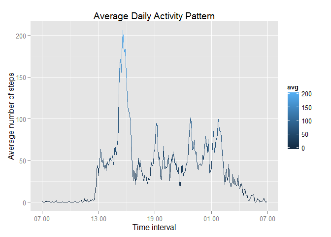

# Reproducible Research: Peer Assessment 1


## Loading and preprocessing the data

1. Apply packages

Package *dplyr* is used for data processing, and package *ggplot2* is used for ploting.


```r
library(dplyr)
library(ggplot2)
```

2. Load the data

```r
unzip("activity.zip")
activity <- read.csv("activity.csv")
```

## What is mean total number of steps taken per day?

1. Processing the data

```r
daily.steps <- activity %>% group_by(date) %>% 
    summarize(sum = sum(steps, na.rm = TRUE))
```

2. Plot the histogram

```r
h <- ggplot(daily.steps, aes(x = sum))
h + geom_histogram(binwidth = 1000, aes(fill = ..count..)) +
    labs(list(title = "Daily Activity", 
              x = "Number of steps per day", y = "Count"))
```

 

3. Calculate the mean and median

```r
mean(daily.steps$sum)
```

```
## [1] 9354.23
```

```r
median(daily.steps$sum)
```

```
## [1] 10395
```

## What is the average daily activity pattern?

1. Data processing

```r
avg.activity <- activity %>% group_by(interval) %>% 
    summarize(avg = mean(steps, na.rm = TRUE))
avg.activity$time <- strptime(sprintf("%04d", avg.activity$interval), 
                          format="%H%M") 
    # class: "POSIXlt" "POSIXt" 
```

2. Make a time series plot

```r
library(scales) # for using scale_x_datetime
t <- ggplot(avg.activity, aes(x = time, y = avg))
t + geom_line(aes(colour = avg)) + 
    scale_x_datetime(labels = date_format("%H:%M")) +
    labs(list(title = "Average Daily Activity Pattern", 
              x = "Time interval", 
              y = "Average number of steps"))
```

 

3. Find the interval with the maximum value

```r
avg.activity$interval[which.max(avg.activity$avg)]
```

```
## [1] 835
```

## Imputing missing values

1. Calculate the total number of missing values in the dataset

```r
sum(is.na(activity$steps))
```

```
## [1] 2304
```

2. Filling in all of the missing values

```r
new.activity <- activity %>% group_by(interval) %>% 
    mutate(avg = mean(steps, na.rm = TRUE)) 
new.activity$steps[!complete.cases(new.activity)] <-
    new.activity$avg[!complete.cases(new.activity)]
```

3. Make a histogram of the total number of steps taken each day

```r
new.daily.steps <- new.activity %>% group_by(date) %>% 
    summarize(sum = sum(steps, na.rm = TRUE))

h <- ggplot(new.daily.steps, aes(x = sum))
h + geom_histogram(binwidth = 1000, aes(fill = ..count..)) +
    labs(list(title = "Daily Activity (Replacing Missing Data)", 
              x = "Number of steps per day", y = "Count"))
```

 

4. Calculate the mean and median total number of steps taken per day

```r
mean(new.daily.steps$sum)
```

```
## [1] 10766.19
```

```r
median(new.daily.steps$sum)
```

```
## [1] 10766.19
```

## Are there differences in activity patterns between weekdays and weekends?

1. Create a new factor variable with 2 levels -- "weekday" and "weekend"

```r
week.activity <- activity %>% mutate(day = weekdays(as.Date(date))) %>%
    mutate(weekday = ifelse(day == "Sunday" | day == "Saturday", 
                            "weekend", "weekday"))
week.activity$weekday <- as.factor(week.activity$weekday)
```

2. Make a weekday v.s. weekend activity pattern

```r
week.activity <- week.activity %>% group_by(weekday, interval) %>% 
    summarize(avg = mean(steps, na.rm = TRUE))
week.activity$time <- as.POSIXct(
    strptime(sprintf("%04d", week.activity$interval), format="%H%M"))
        # class: "POSIXct" "POSIXt"  
        # Use Date class POSIXlt, POSIXt render the error occurs
        # "Error: column 'time' has unsupported type : POSIXlt, POSIXt"
```

3. Make a time series plot

```r
t <- ggplot(week.activity, aes(x = time, y = avg))
t + geom_line(aes(colour = avg)) + facet_grid(weekday ~ .) + 
    scale_x_datetime(labels = date_format("%H:%M")) +
    labs(list(title = 
                  "Average Daily Activity Pattern: Weekday vs. Weekend", 
              x = "Time interval", 
              y = "Average number of steps")) 
```

 
